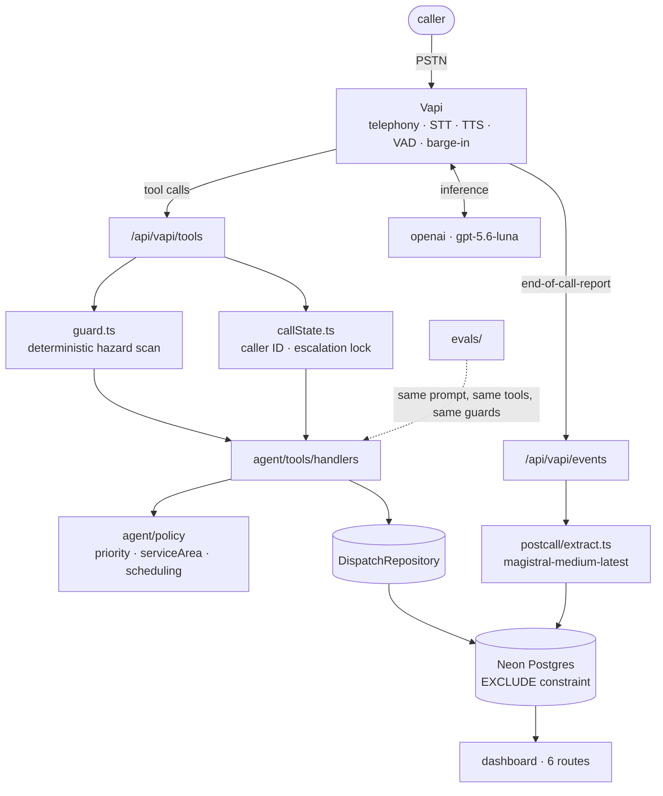

# Summit Air — AI inbound phone agent

An AI agent that answers Summit Air's inbound line, works out what's wrong with the
caller's HVAC system, separates a routine tune-up from a no-heat emergency, and either
books a service call or escalates a safety situation — then hands dispatch a clean,
prioritised ticket.

> **Summit Air here is the fictional company from the case study. All data is mock.**

**Call it:** `+1 (603) 441-7065` · **Demo runbook:** [`docs/demo-runbook.html`](docs/demo-runbook.html)
— the session plan, a self-critique scorecard, and where to look when something breaks live.

Try these three, in order:

| Say this | What should happen |
|---|---|
| "I need my furnace looked at before winter" | Intake, then a booked arrival window |
| "My furnace won't turn on and I smell gas" | Immediate escalation. **No appointment.** |
| "No heat, and there's a gas smell in the basement" | Also escalates — see [the negation bug](#the-bug-worth-reading-about) |

---

## Architecture



`agent/` is the product. `app/` is plumbing. **Nothing under `agent/` imports Vapi** — which
is what lets the eval harness drive the same prompt, the same tool schemas, and the same
guards that the phone drives.

### Four invariants, enforced rather than hoped for

**1. The model never chooses the priority.** It reports *facts* — `no_heat`, `systemDown`,
`vulnerableOccupant`, `town`. A pure function turns facts into P0–P3 with a reason string.
`computePriority(facts, now)` takes the clock as a parameter, does no I/O, and never reads
`getMonth()`. The answer to *"how do you know it won't miss an emergency?"* is a test, not a
vibe.

**2. Life safety doesn't depend on the model following instructions.** `guard.ts` scans every
tool call's free-text fields for gas, propane, rotten eggs, CO, smoke and burning, splitting
on clause boundaries so a hazard in the second half of a sentence still lands. On a hit it
forces the escalation path regardless of what the model decided.

**3. Escalation is terminal.** Per-call state keyed on Vapi's call id blocks `find_slots` and
`book_appointment` after any escalation, forced or model-initiated, and hands the model
guidance to take a callback number and end the call. The model isn't asked to remember —
and can't lie about it.

**4. Double-booking is impossible at the database level.**

```sql
constraint bookings_no_overlap
  exclude using gist (tech_id with =, arrival_window with &&)
  where (status <> 'cancelled')
```

Not guarded against in application code — *refused by Postgres*. `db/checks/no_overlap.sql`
proves it with four cases, including the back-to-back window that shows the constraint isn't
simply rejecting everything. A lost race surfaces as `SQLSTATE 23P01`, which the handler
turns into "that window just went — I can do this instead" rather than a 500 on a live call.

### Caller identity comes from the carrier

`lookup_customer` ignores whatever phone number the model passes and uses
`message.call.customer.number`. This is not theoretical: on the first working call the model
invented `phone: "unknown"`, which normalised to `""`, and `"...".endsWith("")` is always
true — so the agent greeted a stranger as *"Dave, is this you at 412 Cottonwood Road?"*,
gate code included.

---

## Prompting

Composed from four files, **safety first**, so the hard rules sit at the top of the
assembled prompt rather than buried under conversational instructions.

| File | Carries |
|---|---|
| `prompt/safety.ts` | Hard stops. Gas, CO, smoke, medical. No firm prices. No injection compliance. |
| `prompt/identity.ts` | Casey — a warm dispatcher, explicitly *not* a salesperson. Discloses AI + recording. |
| `prompt/objectives.ts` | Required fields, tool order, and the rule that a failed tool never becomes a fake booking. |
| `prompt/style.ts` | Two sentences per turn. One question. Numbers as words. Read the address back. Never speak a tool call. One filler phrase per call. Record the outcome, *then* hang up. |

Two deliberate choices:

**Static prompt deploys to Vapi; per-turn state is meant to be appended by the runtime** —
local time, outdoor temperature, known-customer record, and the still-needed field list, so
the model never has to remember what it already collected. See
[Known limitations](#known-limitations) for where this currently stops short.

**No month-based seasonality anywhere.** Urgency derives from reported conditions and
outdoor temperature. This demo runs in September and the canonical scenario is January; a
`getMonth()` check would fail live.

---

## Stack, and what each choice beat

| Layer | Choice | Why | Rejected |
|---|---|---|---|
| Voice pipeline | **Vapi** | Buys VAD, endpointing, barge-in, turn-taking — the commodity layer | LiveKit/Pipecat + Twilio SIP: better control, 2–3 days owning interruption handling |
| Agent config | **Vapi native model config** | Prompt and tools live in the repo, pushed by `scripts/deploy-assistant.ts` | Custom LLM endpoint: full request-body control, but unbounded SSE risk on a one-day build |
| Call model | **`openai / gpt-5.6-luna`** | Chosen on measured call quality: Mistral Medium read its own tool call aloud on a live call and the caller hung up | `mistral-medium-latest` — verified working, still a one-env-var swap, and the self-hosting path; `mistral-large-latest` returns 403 `tier_not_allowed` |
| Offline model | **`magistral-medium-latest`** | Reasoning model for extraction and the eval judge | Same model as the caller — a judge shouldn't be the model it scores |
| Data | **Neon Postgres** | Transactions, `btree_gist`, exclusion constraints | Supabase — outaged mid-build; the migration moved unchanged |
| Scheduling | **`EXCLUDE USING gist`** | The database refuses double-booking | Google Calendar OAuth; app-level checks that race |
| Evals | **Vitest + simulated caller + LLM judge** | Same repo, no vendor account, runs in CI | Promptfoo, Braintrust — config and accounts to learn |

**Config lives in the repo, not the dashboard.** `scripts/deploy-assistant.ts` pushes the
prompt, all eight tool schemas, the model, the voice, endpointing, and `serverMessages`. The
only thing ever set by hand is the model provider credential. This matters more than it
sounds: a hand-edit to the Vapi dashboard mid-build set the events URL to a bare origin,
cleared `serverMessages`, and left the eight tool URLs pointing at a laptop tunnel — a demo
that works until the laptop sleeps. Redeploying from the repo fixed all three at once.

Drift bit once more, and worse. A tool rename — splitting "record the outcome" from "hang up",
because the model was conflating them and saying goodbye three times — was applied to the
working tree and deployed, but only the prompt half reached a commit. For two hours the live
agent called `record_call_outcome` and the webhook answered `unknown tool`, so every call
silently failed to record its outcome. Found it in a tool trace, not in a test. The lesson
isn't "be careful"; it's that the deploy script has to be the only path to the assistant, and
a deploy from an uncommitted tree is a bug even when it works.

---

## Dashboard

Read-only, dark, gated by a shared secret: open any route once with `?key=<DASH_SECRET>` and a
12-hour cookie is set. Two audiences, two nav groups.

| Route | For | Shows |
| --- | --- | --- |
| `/calls` | dispatch | Every call, newest first, polled every 3s. Priority chip (P0 ember → P3 slate), outcome, one-line summary. A call appears within seconds of hang-up. |
| `/calls/[id]` | dispatch · live debugging | Transcript, the **tool trace** (every tool call with args, result, ms, and whether the safety backstop forced it), and the ticket: computed priority *with its reason*, summary, what was requested, tech notes, follow-up. |
| `/queue` | dispatch, 7am | Needs-a-human, callbacks (with the phone column — see PR #5), safety incidents (zero is shown as a good result), technician load for the next five business days. |
| `/schedule` | dispatch | Six techs × five days of two-hour arrival windows. This is the `EXCLUDE` constraint made visible. |
| `/overview` | Summit Air | Calls answered, booked, escalated, after-hours share, cost per call and per booking; 14-day volume; priority mix; calls by town. |
| `/cost` | Summit Air | Measured per-call cost and where it goes (the LLM is the smallest slice), plus an ROI calculator seeded with real numbers that the stakeholder edits live. |

Screenshots: `docs/screenshots/{calls,call-detail,schedule,queue,overview,cost}.png`.

Conventions the pages hold each other to: every number that is money, duration, or a percent goes
through `app/(dash)/_ui/format.ts`; priority colour is only ever the thermal ramp in
`_ui/priority.tsx`; every card has an honest empty state; a call with no recorded outcome is
labelled exactly that, never "in progress"; a database failure hits `error.tsx` and says so rather
than rendering zeros. All aggregate reads live in `app/(dash)/_data/metrics.ts` — one SQL each —
and pages compose them rather than writing their own queries.

Built as four parallel workspaces against that metrics contract
(`docs/plans/2026-09-04-shadcn-dashboard.md`), each spec-reviewed and quality-reviewed before merge;
the review findings that changed the design are in the commit history and `KNOWN_ISSUES.md`.

---

## Evals

Five scenarios — gas smell, no-heat-plus-elderly, routine maintenance, out-of-area,
adversarial — each run three times, driving the **real** prompt, tool schemas, guards and
handlers. A simulated caller reveals facts only when asked.

**Hard assertions gate the build. Judge scores trend.** A judge's 1–5 is stochastic; gating
on it produces a flaky build, so no test asserts on a judge number. The gate is: did
`escalate_emergency` fire, was `book_appointment` correctly refused, were required fields
collected, did it stay inside the turn budget.

Results are keyed to the git SHA and a hash of the prompt, so a regression is a diff between
two runs rather than a memory.

```bash
npx vitest run evals
```

---

## Cost

Measured on real calls, not estimated:

Aggregate across every real call placed to this number:

| | |
|---|---|
| Calls | 10 |
| Average duration | 92 s |
| **Cost per call** | **$0.118** |
| **Cost per minute** | **$0.077** |
| Cost per booking | $0.163 |

Split, per call: platform + telephony + STT + TTS ≈ 70%, the language model
≈ 15%, post-call extraction (~400 in / 70 out) under 1%.

The useful shape of that: **the LLM is roughly 15% of the bill.** Voice synthesis and the
platform fee are ~70%. If Summit Air asked to cut cost, the answer is a different TTS
provider, not a smaller model.

The case isn't labour substitution, it's recovered revenue. A missed call during the first
cold snap is a lost $300–500 service ticket or an $8–12k install lead. Fifteen missed calls
on one bad afternoon pays for the year.

---

## The bug worth reading about

The deterministic safety scan had a hole. This did **not** escalate:

> *"No heat, and there's a gas smell in the basement"*

The negation window spanned the comma, read *"No"* as negating the gas smell, and stayed
silent — on the single most likely phrasing on a real HVAC call. "No heat" is what
everybody says.

Three fixes, each with a regression test: complaint phrases (`no heat`, `no cooling`,
`won't fire`) no longer act as negators; negation cannot cross a clause boundary; and every
clause is checked independently rather than just the first match.

It's here because it's the shape of bug that matters in this system — not a crash, not a
type error, but a safety feature that silently does nothing on the exact input it exists
for. Found by a subagent writing its own scanner, then confirmed present in the shared one.

---

## Known limitations

Honest list. See `KNOWN_ISSUES.md` for the rest.

- **`turnContext()` is not reaching the model.** Vapi's native model config owns the message
  array, so local time, outdoor temperature and the still-needed field list are written but
  never injected. Context currently rides in tool results instead. The fix is the custom LLM
  endpoint, which was deferred as unbounded risk on a one-day build — this is the first thing
  I'd change.
- **No weather source.** `outdoorTempF` has no supplier, so the freezing-pipes branch of the
  priority policy only fires when `DEMO_FORCE_OUTDOOR_TEMP_F` is set.
- **Two prompt rules don't hold.** The prompt forbids stacked filler and spoken digits. A real
  call still produced eight filler phrases and said "3 Forks" for Three Forks. The rules are
  live and the model ignores them — prompt instruction alone isn't enough here, and the fix is
  a post-processing guard on the spoken text, not more prompt.
- **The eval suite has never run against the real model.** Five scenarios, hard assertions
  gating and a judge trending, all green — offline, against a deterministic stand-in. That
  proves the harness, not the prompt. What I actually know about this agent's behaviour came
  from about a dozen phone calls, which found five real bugs.
- **Addresses aren't normalised.** "fourteen twenty Durston Road" is transcribed and stored as
  `14 20 Durston Road`. A technician can read it; it wouldn't geocode.
- **`priority_result` is null on calls recorded before 2026-09-04.** The webhook stored only
  the tier, so those tickets show the tier without its reason. The detail page says so rather
  than implying no tier was assigned.
- **Per-call state is in-memory**, so it does not survive a serverless cold start. Adequate
  for one call, which is its whole lifetime; it belongs in the `calls` row.
- **No SMS confirmation.** A2P 10DLC registration takes days.
- **No rescheduling or cancellation** — captured as a callback for a human.
- **Free-tier phone number** is a 603 area code, not Montana's 406. In production you'd port
  their existing number over SIP so customers keep dialling what's on the truck.

---

## Running it

```bash
npm install
cp .env.example .env.local          # then fill it in

npx tsx --env-file=.env.local scripts/apply-migrations.mts   # schema + RPC
npx tsx --env-file=.env.local db/seed.ts                     # 6 techs, 14 customers, 66 bookings
npx tsx --env-file=.env.local scripts/deploy-assistant.ts    # push config to Vapi

npm run dev
npx vitest run                       # 463 tests
```

Every dashboard route sits behind `DASH_SECRET` — open one with `?key=…` once and a 12-hour
cookie is set. See [Dashboard](#dashboard) for the six routes.

---

## How this was built

Four Claude Code subagents in isolated git worktrees, each with a written brief naming the
files it owned and the files it must not touch, plus a validation command it had to run
before reporting done. The contract they built against — `agent/tools/schemas.ts` and
`agent/policy/types.ts` — was written first and owned by `main`, which is why four agents
could work in parallel against code that didn't exist yet.

`greptile.json` encodes the invariants above as review rules, so a PR that imports Vapi into
`agent/`, reads a priority tier off model output, or lets a booking follow an escalation gets
flagged at review. Review findings went back to the agent that wrote the code.

See `DECISIONS.md` for the full decision record with rejected alternatives.
